# Fuzzy Greenhouse Climate Control

**Fuzzy logic and AI for agricultural climate control**: greenhouses, vertical farms, germination
chambers, livestock houses, mushroom rooms and cold stores. Includes a digital twin, model
predictive control, sensor fault detection, ROS 2 / Modbus / MQTT integration and PLC code export.

[](https://github.com/basheeraltawil/fuzzy-greenhouse-climate-control/actions/workflows/ci.yml)
[](LICENSE)


This project started as a MATLAB Mamdani fuzzy controller
([`matlab/temperature_controlling1.fis`](matlab/temperature_controlling1.fis)) that turned a
sensed and a target temperature into two 8-bit PWM signals for a heater and a cooler.
**Version 2** builds on it: a tested Python package, with ROS 2 / Modbus / MQTT integration, for
greenhouses, growth chambers, livestock houses, mushroom rooms and cold stores. Fuzzy logic stays
at its core and is combined with AI.

**Video: the fuzzy logic system explained.** A walkthrough of the original fuzzy temperature
controller that this project builds on, covering membership functions, the rule base and the
PWM outputs:

[](https://www.youtube.com/watch?v=Dvy35QIY8Qo)

What version 2 adds:

| Layer | What it adds |
|---|---|
| **Fuzzy control, redesigned** | setpoint-independent incremental **fuzzy-PI** (7×7 rules) with anti-windup and bumpless transfer; still exportable to MATLAB `.fis` |
| **Industrial actuation** | split-range sequencing (heat → free-cooling vents → pad/compressor) with no heat/cool fighting, minimum ventilation, heat-and-vent dehumidification |
| **Safety supervisor** | redundant-sensor validation and fusion, frost/heat limits with hysteresis, interlocks, slew limits, compressor anti-short-cycle, fail-safe mode, alarm management |
| **Digital twin** | grey-box thermal model (air + thermal mass + vapour balance, solar, crop transpiration, pad cooling, refrigeration), realistic sensors with injectable faults, synthetic or recorded weather |
| **AI: system identification** | physics-informed learned model with automatically identified actuator lags (optional neural residual) |
| **AI: model predictive control** | economic MPC using weather forecasts and the recipe preview, with fuzzy-PI fallback |
| **AI: anomaly detection** | IsolationForest + model residuals find drifting, frozen or spiking sensors and weak heaters, then remove bad sensors from the fusion |
| **AI: auto-tuning** | differential evolution tunes the fuzzy/PID gains on the digital twin |
| **AI: LLM assistant** | Claude drafts crop climate recipes from plain language and writes operator shift reports; a deterministic validator and a human always approve |
| **Middleware and field** | ROS 2 Humble package (sim-time digital twin and hardware launch), Modbus TCP PLC link with heartbeat watchdog, MQTT telemetry, virtual PLC for commissioning |
| **Embedded export** | the fuzzy controller compiles to an **IEC 61131-3 Structured Text** function block (PLC) and a **C99 header** (ESP32/STM32/Arduino) |

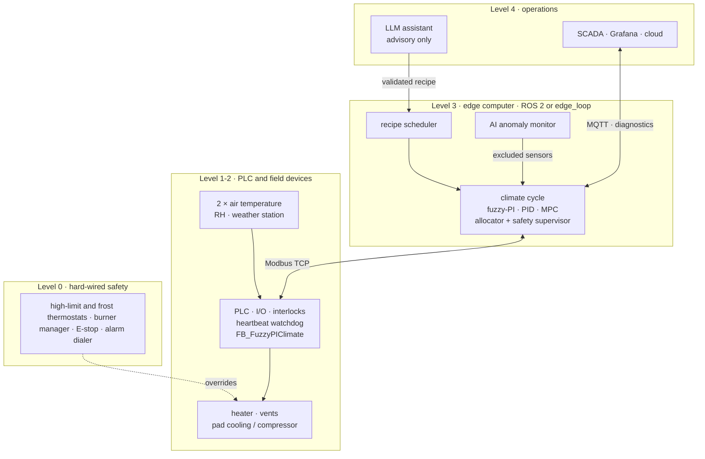

Level 0 works independently of all software: it cuts heating or forces protection even if the PLC
and edge computer fail.

**Documentation**: [scenarios](docs/SCENARIOS.md) · [theory and equations](docs/THEORY.md) ·
[design calculations](docs/DESIGN_CALCULATIONS.md) · [code architecture](docs/ARCHITECTURE.md) ·
[implementation guide](docs/IMPLEMENTATION_GUIDE.md) · [engineering analyses](analysis/README.md) ·
[reading paths for students, researchers and engineers](docs/README.md)

---

## 1. How it works

### 1.1 One control cycle

`agriclimate/runtime.py` holds the complete cycle. The simulator, the ROS 2 controller node and
the Modbus edge loop all call the same `ClimateRuntime.step()`, so what is tested in simulation
is exactly what runs on the plant.

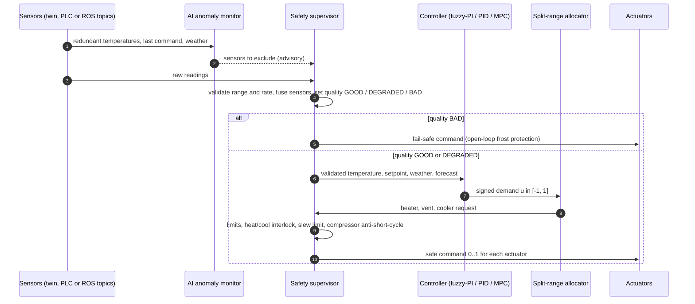

### 1.2 Fuzzy-PI controller

The controller works on the **error**, not on absolute temperatures, so one 7×7 rule base
serves every crop and setpoint. Three gains adapt it to a facility, and the auto-tuner can set
them.

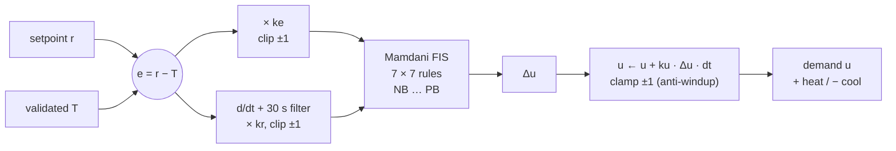

### 1.3 Split-range allocator

The allocator turns the signed demand into actuator commands. Heating and cooling can never
run together, and free cooling with outdoor air is used before any energy is spent.

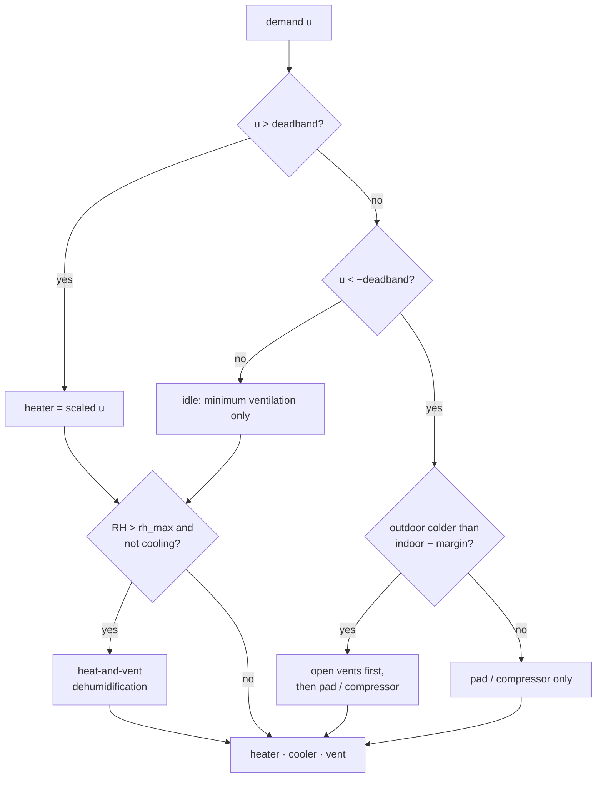

### 1.4 Safety supervisor modes

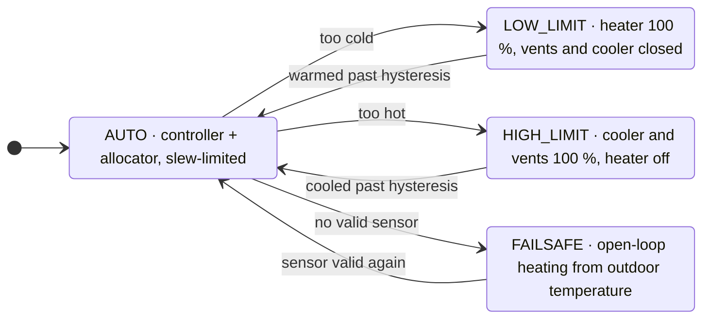

"Too cold" and "too hot" are the frost and heat limits from the scenario's `supervisor:` block.
The limit modes stay latched until the temperature has recovered by `limit_hysteresis`
(1 K by default). `FAILSAFE` starts when no sensor has been valid for longer than
`stale_timeout_s`. On return, the controller restarts bumplessly from its last demand.

## 2. Results (digital twin, 10 agricultural scenarios)

`agriclimate benchmark --plots` produces [docs/results/benchmark.md](docs/results/benchmark.md).
KPIs use the **true** air temperature, which is what the crop or animals experience. The numbers
come from the digital twin, not from a real site. Selected rows:

| Scenario | Controller | RMSE [K] | in band [%] | max err [K] | crop-stress [h] | energy [kWh] | actuator travel | heat+cool overlap [h] |
|---|---|---|---|---|---|---|---|---|
| tomato greenhouse (72 h) | legacy FIS | 5.27 | 19.4 | 9.91 | 17.0 | 4331 | 7 | 72.0 |
| | fuzzy-PI | 0.29 | 98.3 | 2.20 | 0 | 4148 | 121 | 0 |
| | PID (tuned) | 0.21 | 99.2 | 2.20 | 0 | 4150 | 279 | 0 |
| | MPC | 0.34 | 98.5 | 1.52 | 0 | 4058 | 45 | 0 |
| cucumber heat wave | PID | 1.43 | 77.7 | 5.86 | 0 | 653 | 161 | 0 |
| | MPC | 1.43 | 77.7 | 5.86 | 0 | 597 | 29 | 0 |
| broiler brooding (120 h) | legacy FIS | 21.2 | 0 | 25.0 | 120 | 6434* | 9 | 120 |
| | fuzzy-PI | 0.16 | 99.7 | 3.55 | 0 | 14338 | 155 | 0 |
| | MPC | 0.15 | 99.9 | 1.66 | 0 | 14283 | 30 | 0 |
| vertical farm, LEDs | fuzzy-PI | 0.31 | 98.6 | 3.70 | 0 | 421 | 66 | 0 |
| | PID | 0.22 | 98.9 | 2.73 | 0 | 420 | 135 | 0 |
| | MPC | 1.80 | 48.9 | 6.12 | 2.0 | 432 | 477 | 0 |
| sensor and boiler faults | fuzzy-PI, rules only | 1.71 | 65.2 | 4.14 | 0 | 5514 | 114 | 0 |
| | fuzzy-PI + AI monitor | 0.35 | 97.6 | 3.25 | 0 | 6213 | 124 | 0 |
| total sensor loss (2 h) | legacy FIS | 11.0 | 0.1 | 14.8 | 23.6 | 2295 | 3 | 36 |
| | fuzzy-PI, fail-safe | 0.54 | 93.8 | 4.25 | 0 | 5846 | 67 | 0 |

\* The legacy controller uses less energy only because it leaves the chicks 20 K too cold.

**What the results show:**
* Every redesigned controller beats the original by an order of magnitude and never heats and
  cools at the same time.
* The tuned PID tracks slightly more tightly than fuzzy-PI; fuzzy-PI moves the actuators 1.5–5×
  less (about 2.5× typically), which means less valve, burner and compressor wear.
* MPC uses the forecast and the recipe preview. Where its model covers the load, it uses the least
  energy (−0.4 % to −8.5 % vs PID) and moves the actuators 2–20× less. In the vertical farm its
  model has no input for the LED load, and it performs clearly worse than feedback control.
* Sensor faults: with two sensors, the AI monitor isolates frozen and drifting sensors that rules
  alone cannot attribute (97.6 % vs 65 % in band). The frozen sensor is flagged 33 min after it
  freezes, the weak boiler is reported, and no false alarms occur in the eight healthy
  scenarios. A third sensor with median voting solves most faults without AI
  ([analysis 06](analysis/output/06_fault_detection.md)).
* Frost and heat-wave results are limited by equipment capacity; no controller can do better.
  [Design calculations](docs/DESIGN_CALCULATIONS.md) show these limits in advance.
* The ±0.4 K ripple on humid tomato nights comes from the temperature/humidity coupling of
  heat-and-vent dehumidification (RH > 88 %).

| Tomato greenhouse | Sensor & actuator faults |
|---|---|
| 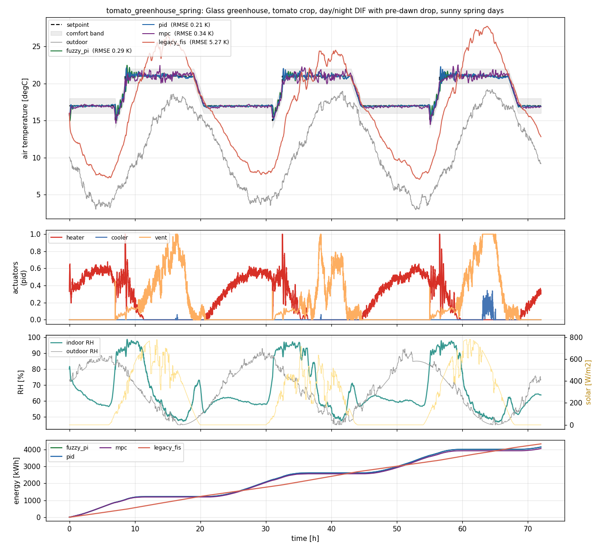 | 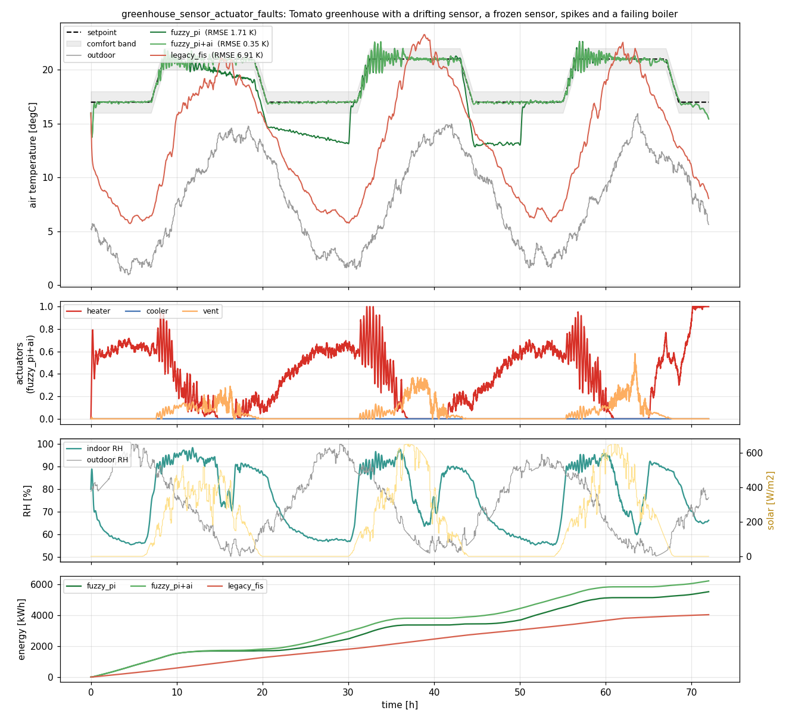 |

## 3. Agricultural task scenarios

All scenarios are YAML files in [`scenarios/`](scenarios), each with its agronomic background
inside. **[docs/SCENARIOS.md](docs/SCENARIOS.md)** explains the real-world problem, what each one
tests and the results.

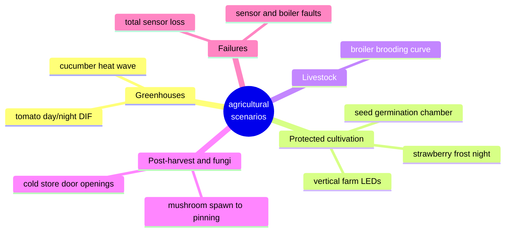

| Scenario | Facility | Agricultural task | What it tests |
|---|---|---|---|
| `tomato_greenhouse_spring` | 1000 m² glasshouse | tomato day/night DIF 21/17 °C with 2 K pre-dawn drop | solar gain, vent staging, recipe ramps, RH < 88 % |
| `seed_germination_chamber` | insulated chamber | seeds held at 25 ± 0.5 °C, then 20 °C hardening | tight tolerance, compressor anti-short-cycle |
| `frost_protection_polytunnel` | PE polytunnel | strawberry flowers through a −7 °C radiative frost night | undersized heater, frost limits |
| `heatwave_cucumber_cooling` | glasshouse + pads | 38 °C dry heat wave, cucumber 26/20 °C | vents → evaporative pad cooling, shading |
| `broiler_brooding` | tunnel-ventilated broiler house | chicks days 7–12, brooding curve 29 → 27 °C, minimum ventilation | slow recipe, large internal heat gain |
| `cold_storage_door_openings` | post-harvest cold room | vegetables at 2 °C, forklift door every 3 h | refrigeration, door disturbances, freezing limit |
| `mushroom_spawn_to_pinning` | mushroom room | spawn run 25 °C → pinning drop to 18 °C | compost heat, recipe step, high RH |
| `vertical_farm_lettuce` | insulated indoor farm | lettuce, 16 h LED photoperiod (30 kW heat) | large periodic disturbance, cooling-dominated |
| `greenhouse_sensor_actuator_faults` | glasshouse | tomato crop with drift, frozen sensor, spikes and boiler loss | supervisor, AI anomaly monitor |
| `sensor_loss_failsafe` | glasshouse | all sensors lost for 2 h on a 0 °C night | fail-safe mode, bumpless return |

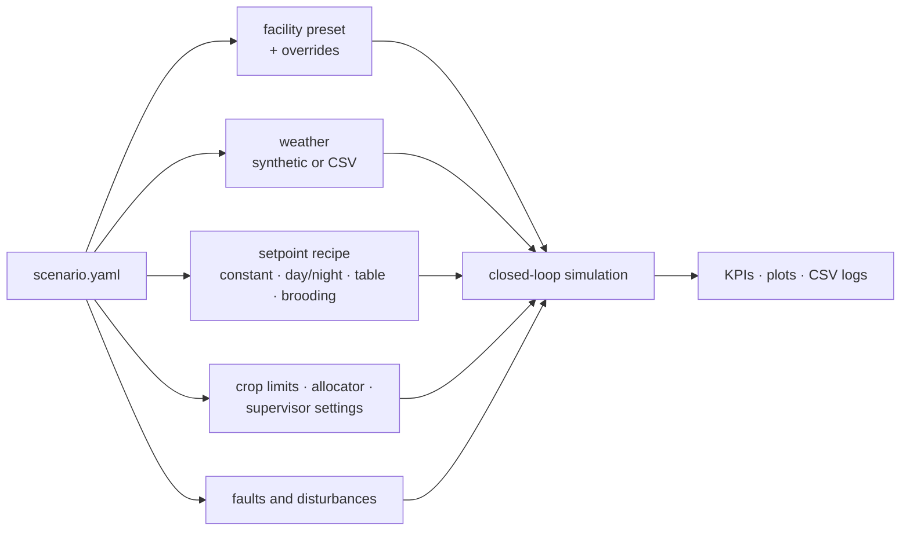

Write your own by copying one of them; the template and all options are in
[docs/SCENARIOS.md](docs/SCENARIOS.md#writing-your-own-scenario).

## 4. Quick start

```bash
git clone https://github.com/basheeraltawil/fuzzy-greenhouse-climate-control.git
cd fuzzy-greenhouse-climate-control
pip install -e ".[ai]"            # core + scikit-learn   (".[all]" adds LLM, Modbus, MQTT)

agriclimate list                                           # scenarios
agriclimate run tomato_greenhouse_spring --plot tomato.png # compare fuzzy_pi / pid / mpc / legacy
agriclimate run greenhouse_sensor_actuator_faults -c fuzzy_pi fuzzy_pi+ai
agriclimate benchmark --plots --out results                # all scenarios, all controllers
agriclimate analyze-legacy --plot surfaces.png             # audit of the original FIS
pytest -q                                                  # 34 tests
```

Python API:

```python
from agriclimate.sim import Scenario, run_scenario
sc = Scenario.load("broiler_brooding")
res = run_scenario(sc, "mpc")          # "fuzzy_pi", "pid", "legacy_fis", suffix "+ai"
print(res.metrics); res.log.to_csv("run.csv")
```

## 5. AI features

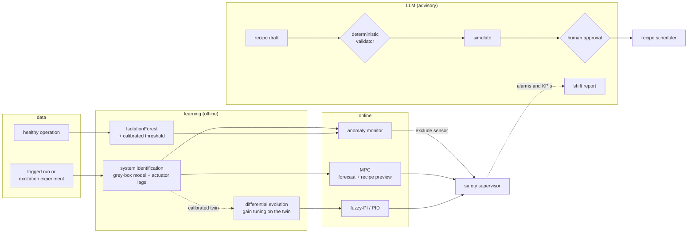

How the anomaly monitor decides:

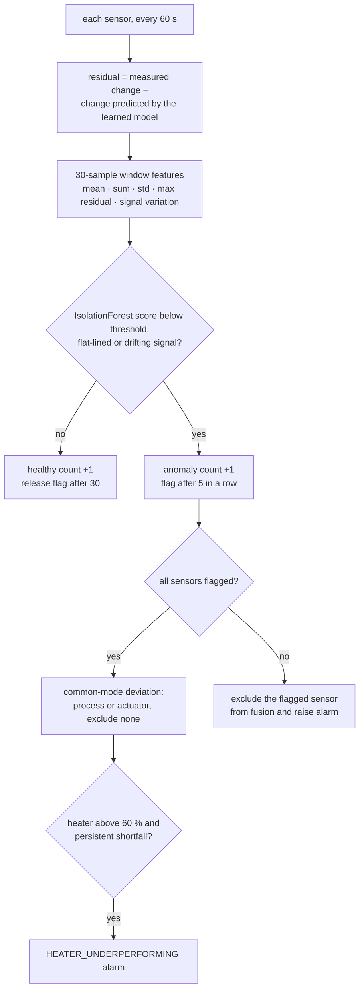

| Feature | Command / module | Notes |
|---|---|---|
| System identification | `agriclimate identify [--csv site_log.csv] --out model.json` · `ai/sysid.py` | energy-balance regressors, actuator lags found by grid search, reports 1 h open-loop RMSE; `residual="mlp"` adds a neural correction |
| MPC | controller `mpc` · `control/mpc.py` | 1 h horizon, move blocking, forecast + recipe preview, offset-free, fuzzy-PI fallback |
| Anomaly monitor | suffix `+ai` · `ai/anomaly.py` | trained on healthy data only (no labelled faults needed), threshold calibrated for no false alarms, common-mode logic, flat-line, drift and heater-underperformance checks |
| Auto-tuning | `agriclimate tune <scenario> --controller fuzzy_pi` · `ai/tuner.py` | differential evolution over log-scaled gains; cost = tracking + stress + wear + energy |
| LLM recipe assistant | `agriclimate advise "cherry tomato transplants, 2 weeks then hardening" --simulate` | Claude (`claude-opus-5`) structured output → `validate_recipe` hard envelope → simulated → human approval |
| LLM shift report | `agriclimate report greenhouse_sensor_actuator_faults` | explains alarms and KPIs, suggests maintenance |

The LLM features need `pip install anthropic` and an `ANTHROPIC_API_KEY`. Everything else works
offline. **No AI component ever writes an actuator.** The monitor can only remove a sensor from
fusion. The LLM output must pass the validator, simulation and a human.

## 6. ROS 2 integration (Humble)

```bash
pip install -e ".[ai]"
cd ros2_ws && source /opt/ros/humble/setup.bash && colcon build && source install/setup.bash

# full stack against the digital twin, simulated time at 60x
ros2 launch agriclimate_ros digital_twin.launch.py scenario:=greenhouse_sensor_actuator_faults \
     controller:=fuzzy_pi ai:=true time_scale:=60 namespace:=greenhouse1

# same stack on real hardware (PLC over Modbus TCP)
ros2 launch agriclimate_ros hardware.launch.py plc_host:=192.168.0.10 namespace:=greenhouse1
```

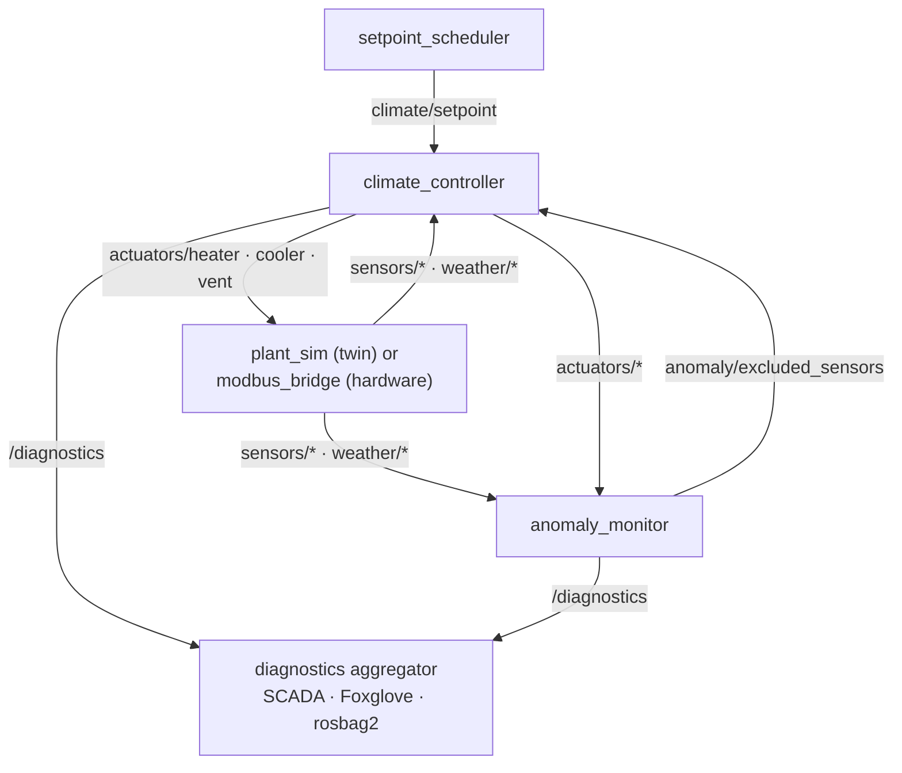

All topics except `/diagnostics` and `/clock` are relative, so they live under the zone
namespace (for example `/greenhouse1/climate/setpoint`). In the digital twin, `plant_sim`
also publishes `/clock` and the other nodes run on simulated time.

| Node | Subscribes | Publishes |
|---|---|---|
| `plant_sim` (twin) / `modbus_bridge` (hardware) | `actuators/{heater,cooler,vent}` | `sensors/temperature_N`, `sensors/humidity`, `weather/*`, `/clock` (sim only) |
| `setpoint_scheduler` | – | `climate/setpoint` |
| `climate_controller` | sensors, weather, setpoint, `anomaly/excluded_sensors` | `actuators/*`, `climate/demand`, `climate/validated_temperature`, `/diagnostics` |
| `anomaly_monitor` | sensors, actuators, weather | `anomaly/excluded_sensors`, `/diagnostics` |

> **Which Python?** ROS 2 Humble runs nodes with the system `/usr/bin/python3`. If you installed
> `agriclimate` into pyenv/conda/venv, the nodes load it directly from this repository checkout
> anyway (or from `$AGRICLIMATE_HOME`). The system Python still needs the dependencies:
> `/usr/bin/python3 -m pip install --user numpy scipy pandas pyyaml matplotlib "pydantic>=2" scikit-learn`.

Only standard messages are used (`sensor_msgs`, `std_msgs`, `diagnostic_msgs`), so any SCADA
bridge, rosbag2, Foxglove or micro-ROS node can connect. One namespace equals one climate zone.
A Docker image is included: `docker build -f docker/Dockerfile -t agriclimate .`.

**Without ROS**, the same control cycle (`agriclimate/runtime.py`) runs in
`python -m agriclimate.io.edge_loop --plc <ip> --mqtt <broker>`.

## 7. Embedded, PLC and MATLAB export

```bash
agriclimate export --out generated
```

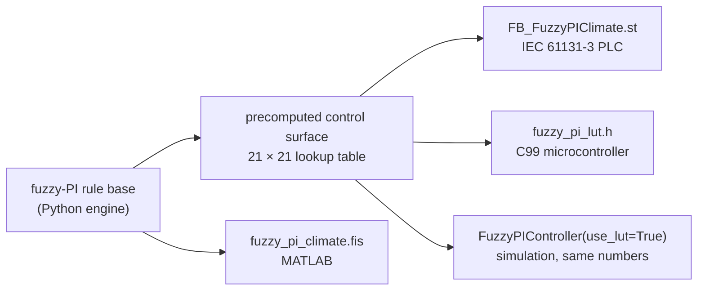

* `generated/plc/FB_FuzzyPIClimate.st`: IEC 61131-3 function block (TIA Portal, CODESYS,
  TwinCAT) with the complete incremental fuzzy-PI, including the rate filter and anti-windup.
* `generated/firmware/fuzzy_pi_lut.h`: allocation-free C99 lookup table with bilinear
  interpolation. Verified to match the Python engine to 1e-5.
* `generated/matlab/fuzzy_pi_climate.fis`: open it in MATLAB `fuzzyLogicDesigner`. The original
  `matlab/temperature_controlling1.fis` is kept unchanged and loads in the Python engine.

## 8. Implementing it in a real facility

The complete procedure is in **[docs/IMPLEMENTATION_GUIDE.md](docs/IMPLEMENTATION_GUIDE.md)**:
bill of materials, safety and compliance checklist, I/O list, commissioning and AI roll-out.
In short:

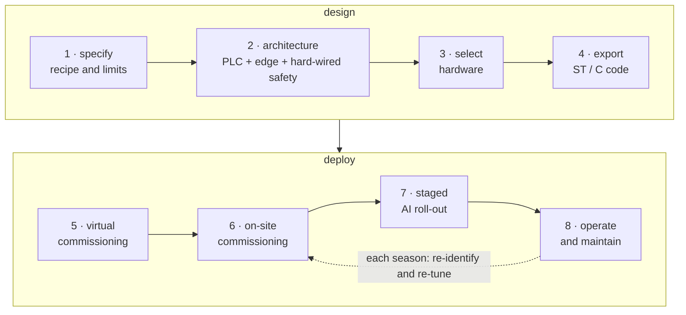

1. **Specify**: write the crop recipe, tolerances and limits as a scenario YAML, or draft it
   with `agriclimate advise`. Simulate it and check actuator sizing.
2. **Design the architecture**: the PLC holds I/O, interlocks, the generated fuzzy-PI block and
   a heartbeat watchdog. The edge computer (ROS 2 or `edge_loop`) holds MPC, AI, recipes and
   logging. Hard-wired thermostats remain the last line of defence.
3. **Select hardware**: redundant aspirated Pt100 probes, RH transmitter, weather station,
   0–10 V/4–20 mA actuators, Modbus TCP/OPC UA, MQTT over TLS.
4. **Export** the ST/C code, import it into the PLC and map the registers.
5. **Commission virtually** with `python -m agriclimate.io.plc_simulator` and the edge loop.
   Test scaling, the fallback when the edge stops, alarms, and fault injection.
6. **Commission on site**: loop checks, sensor calibration, step tests,
   `agriclimate identify --csv site_log.csv`, calibrate the twin, `agriclimate tune`, then
   fallback and alarm tests and a 7-day acceptance run.
7. **Roll out AI in stages**: run the anomaly monitor and MPC in shadow mode for 2–6 weeks, then
   enable them. Re-identify every season. LLM recipes always need validation and approval.
8. **Operate**: MQTT/Grafana dashboards, `/diagnostics`, monthly calibration checks, and shift
   reports.

## 9. Repository layout

```
agriclimate/
  fuzzy/      Mamdani engine, MATLAB .fis reader/writer, fuzzy-PI rule base, ST/C code generator
  plant/      facility digital twin, presets, psychrometrics, weather, sensors + fault injection
  control/    fuzzy-PI, PID, MPC, legacy FIS, split-range allocator, safety supervisor, schedules
  ai/         system identification, anomaly detection, auto-tuning, LLM assistant
  sim/        scenario loader, closed-loop runner, KPIs, plots
  io/         Modbus TCP, MQTT, real-time edge loop, virtual PLC
  runtime.py  one control cycle shared by simulation, ROS 2 and the edge loop
  cli.py      `agriclimate` command
scenarios/    agricultural task scenarios (YAML), explained in docs/SCENARIOS.md
analysis/     engineering analyses (design calculations, tuning, robustness, fault detection)
ros2_ws/src/agriclimate_ros/   ROS 2 package: nodes, launch files, config
matlab/       original FIS (unchanged)
generated/    exported PLC / firmware / MATLAB artefacts
docs/         theory, design calculations, architecture, implementation guide, benchmark results
tests/        pytest suite
```

## 10. Roadmap

* MIMO climate control: temperature, humidity/VPD and CO₂ with a multi-input fuzzy or MPC
  formulation.
* Weather-forecast API adapter (e.g. Open-Meteo) for MPC on real sites.
* Scheduled loads (lights, feeding, door schedules) as feed-forward inputs of the MPC model.
* Safe reinforcement learning inside the safety supervisor.
* Crop-growth models (e.g. TOMGRO) for economic, yield-aware MPC.
* OPC UA server and a micro-ROS ESP32 sensor-node example.

## Author

Basheer Al-Tawil. Version 2 extends the original MATLAB fuzzy temperature controller.
