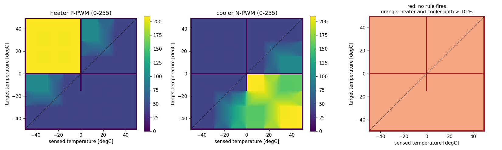
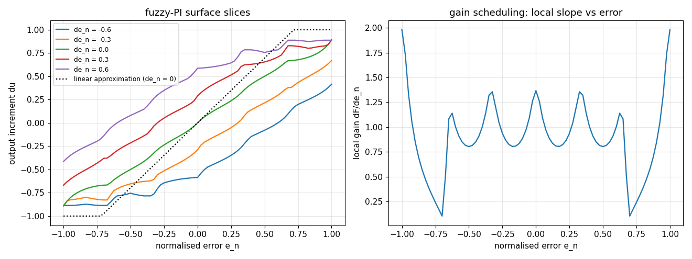

# Engineering analyses

Each script answers one engineering question, runs in seconds to a minute, and writes its
tables and figures to [`output/`](output). Run from the repository root:

```bash
python analysis/01_legacy_fis_analysis.py      # or any other script
```

| Script | Question | Method | Key result |
|---|---|---|---|
| [01_legacy_fis_analysis.py](01_legacy_fis_analysis.py) | What is wrong with the original MATLAB controller? | evaluate the FIS on a 101 × 101 input grid | 8 of 25 rules missing (5.5 % of inputs undefined); heater and cooler both on at ≥ 17 % duty almost everywhere |
| [02_design_calculations.py](02_design_calculations.py) | Can each facility hold its recipe? | steady-state heat balance, operating envelope | greenhouse heater margin 0.91 at −10 °C; vents undersized for full sun |
| [03_step_response_tuning.py](03_step_response_tuning.py) | How fast is the process and what PI gains follow? | heater step test, FOPDT fit, SIMC rule | greenhouse τ ≈ 46 min, K ≈ 20 K per 100 % heater |
| [04_fuzzy_pi_linearization.py](04_fuzzy_pi_linearization.py) | What does the fuzzy-PI do mathematically? | slopes of the rule surface at the origin | equivalent K<sub>p</sub> ≈ 0.42 1/K, T<sub>i</sub> ≈ 670 s; local gain varies 0.8–1.4 for small errors, output saturates for large ones |
| [05_robustness_sensitivity.py](05_robustness_sensitivity.py) | Do the controllers survive model errors? | ±30 % on U-value, thermal mass, heater size, transmittance | RMSE changes by at most 0.05 K |
| [06_fault_detection_evaluation.py](06_fault_detection_evaluation.py) | Which sensor faults are caught, and how fast? | 5 fault types × 3 seeds × 3 monitoring set-ups | 3 sensors (median) or 2 sensors + AI keep the error at or below 0.3 K for frozen and spiking sensors |

The equations behind each method are in [docs/THEORY.md](../docs/THEORY.md); the design numbers
are discussed in [docs/DESIGN_CALCULATIONS.md](../docs/DESIGN_CALCULATIONS.md).

The controller benchmark over all scenarios is a CLI command:

```bash
agriclimate benchmark --plots --out docs/results
```

## Results at a glance

### 01 Legacy FIS


### 02 Operating envelope


### 03 Step responses


### 04 Fuzzy-PI surface


### 05 and 06
See [05_robustness.md](output/05_robustness.md) and [06_fault_detection.md](output/06_fault_detection.md).
