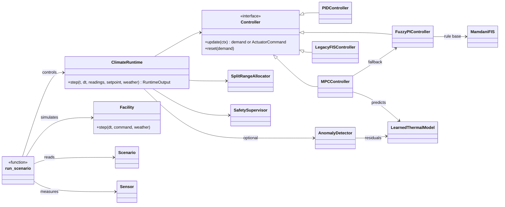

# Code architecture

A guide for reading and extending the code. The package is plain Python (numpy, scipy, pandas);
optional parts (scikit-learn, anthropic, pymodbus, paho-mqtt) are imported only where needed.

## 1. Package map

| Package / module | Responsibility | Main classes and functions |
|---|---|---|
| `agriclimate/fuzzy/` | fuzzy logic | `MamdaniFIS`, `load_fis` / `save_fis` (MATLAB format), `fuzzy_pi_rulebase`, `codegen` (C / ST export) |
| `agriclimate/control/` | controllers and safety | `Controller` (interface), `FuzzyPIController`, `PIDController`, `MPCController`, `LegacyFISController`, `SplitRangeAllocator`, `SafetySupervisor`, schedules |
| `agriclimate/plant/` | digital twin | `Facility`, `FacilityParams`, `PRESETS`, `Sensor`, `SyntheticWeather` / `CsvWeather`, psychrometrics |
| `agriclimate/ai/` | learning components | `LearnedThermalModel` (system identification), `AnomalyDetector`, `tune`, LLM assistant |
| `agriclimate/sim/` | experiments | `Scenario` (YAML), `run_scenario`, `compute_metrics`, plots |
| `agriclimate/io/` | field integration | `ModbusClimateIO`, `MqttBridge`, `edge_loop`, `VirtualPLC` |
| `agriclimate/runtime.py` | one control cycle | `ClimateRuntime` (shared by simulation, ROS 2 and the edge loop) |
| `agriclimate/cli.py` | command line | `agriclimate run / benchmark / tune / identify / export / ...` |
| `ros2_ws/src/agriclimate_ros/` | ROS 2 nodes | plant_sim, climate_controller, setpoint_scheduler, anomaly_monitor, modbus_bridge |
| `analysis/` | engineering analyses | numbered scripts, results in `analysis/output/` |

## 2. How the pieces connect

The same `ClimateRuntime.step()` is called by `sim/runner.py` (simulation), the ROS 2
`climate_controller` node and `io/edge_loop.py`. What is tested in simulation is therefore
exactly what runs in the field.

## 3. Conventions

| Topic | Convention |
|---|---|
| units | SI; temperature °C, power W, energy kWh (reported), time s (scenario times in hours, suffix `_h`) |
| controller output | signed demand `u` in [−1, 1]: positive = heat, negative = cool |
| actuator commands | `ActuatorCommand(heater, cooler, vent)`, each 0..1 (`as_pwm()` gives 0..255) |
| sensor indices | 0-based in code, 1-based in alarm codes and YAML (`SENSOR1_...`, `sensor: 1`) |
| KPIs | always computed from the *true* air temperature of the twin, not from sensor readings |
| names | parameters carry their unit where it helps: `heater_max_w`, `tau_s`, `start_h`, `drift ... K/h` |
| randomness | every random source takes a `seed`, so runs are reproducible |

## 4. Log columns (`RunResult.log`)

`t_s, t_h` time · `setpoint` · `t_true` true air temperature · `t_meas` validated temperature ·
`sensor_N` raw readings · `rh`, `t_out`, `rh_out`, `solar` · `demand` · `heater`, `cooler`,
`vent` commands · `vent_pos` actual vent position · `mode`, `quality` supervisor state ·
`excluded` number of sensors excluded by the AI · `e_heat_kwh`, `e_cool_kwh`, `e_fan_kwh`
cumulative energy.

The same columns (`t_s, t_meas, heater, cooler, vent, t_out, rh_out, solar`) are what
`agriclimate identify --csv` expects from real data.

## 5. Extending the project

**Add a controller**
1. Subclass `Controller` in `agriclimate/control/` and implement `update(ctx)`, which returns a
   demand in [−1, 1], and `reset(demand)`.
2. Register its name in `make_controller()` in `agriclimate/sim/runner.py`.
3. Add it to a scenario's `controllers:` list and run `agriclimate run <scenario>`.

**Add a facility**
Add a `FacilityParams(...)` entry to `PRESETS` in `agriclimate/plant/presets.py`. Check it with
`analysis/02_design_calculations.py` (add its design conditions to `DESIGN`).

**Add a scenario**
Copy a file in `scenarios/`, change the facility, weather, recipe, limits and faults, and run
`agriclimate run <new_name>`. Every scenario is automatically part of `pytest`
(`tests/test_simulation.py`).

**Add a fault type**
Sensor faults: `Sensor.read()` in `plant/sensors.py`. Actuator faults:
`apply_actuator_faults()` in `sim/runner.py`.

**Use real data**
Log `t_s, t_meas, heater, cooler, vent, t_out, rh_out, solar`, then
`agriclimate identify --csv your_log.csv --out model.json`. Replay recorded weather with
`weather: {type: csv, path: ...}`.

## 6. Tests

`pytest -q` runs 34 tests: fuzzy engine and MATLAB compatibility, controllers, supervisor rules,
every scenario, system identification, anomaly detection and the LLM validator (no API call).
CI (`.github/workflows/ci.yml`) runs them on Python 3.10 and 3.12 and builds the ROS 2 package.
