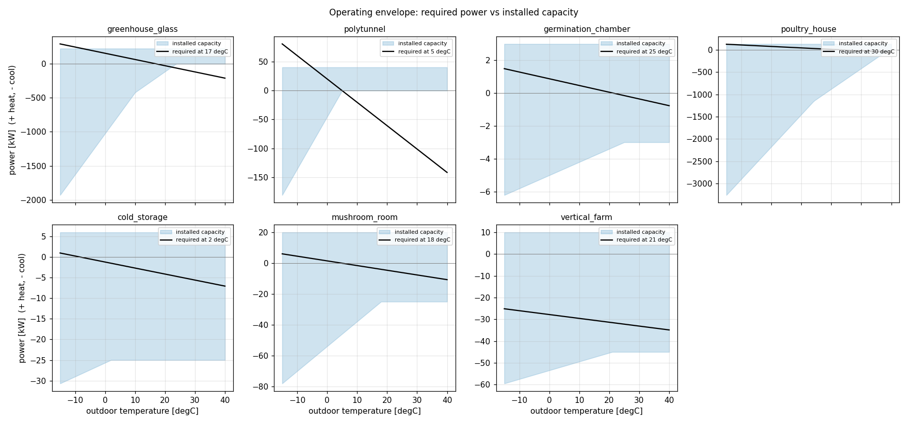
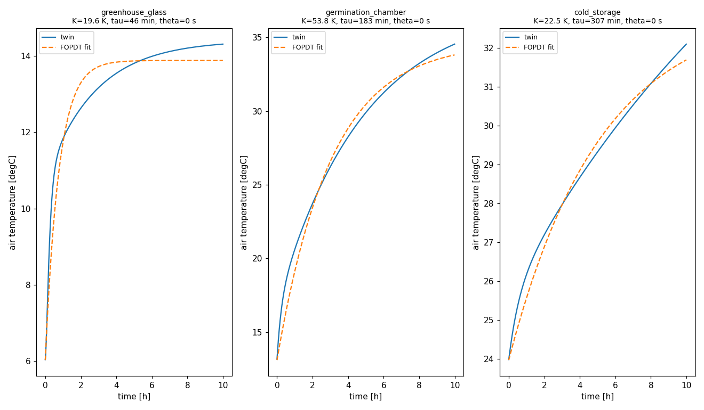

# Design calculations and operating envelope

Before choosing a controller, an engineer checks that the building and its equipment can
physically hold the recipe. This page shows those calculations for the facility presets
(`agriclimate/plant/presets.py`). All numbers are reproduced by
[`analysis/02_design_calculations.py`](../analysis/02_design_calculations.py) and
[`analysis/03_step_response_tuning.py`](../analysis/03_step_response_tuning.py).

The design conditions are typical Central-European values (assumptions, listed in the tables).
Replace them with local design data (e.g. the 1 % winter and summer design temperatures of
your site) before sizing real equipment.

## 1. Worked example: 1000 m² glass greenhouse

Parameters: envelope area 1400 m², U = 6.0 W/(m²K) (single glass), volume 4500 m³,
leakage 0.5 air changes per hour (ACH), heater 250 kW at 90 % efficiency. Air properties:
ρcp = 1.2 × 1006 ≈ 1207 J/(m³K).

| Quantity | Formula | Result |
|---|---|---|
| envelope conductance | UA = U · A = 6.0 × 1400 | 8.4 kW/K |
| infiltration conductance | Hinf = ρcp V ACH / 3600 = 1207 × 4500 × 0.5 / 3600 | 0.75 kW/K |
| heat demand at 17 °C inside, −10 °C outside | Q = (UA + Hinf)(Tin − Tout) = 9.15 × 27 | 247 kW |
| heater output | η P = 0.9 × 250 | 225 kW |
| heater margin | 225 / 247 | **0.91: undersized for −10 °C** |
| air time constant | τ = Cair / (UA + Hinf + hmAfloor) = 10.9 MJ/K / 17.2 kW/K | 11 min |
| peak solar gain (850 W/m²) | Q = I A τglass (1 − 0.45 latent) = 850 × 1000 × 0.7 × 0.55 | 327 kW |
| ventilation to limit ΔT to 4 K | V̇ = Q / (ρcp ΔT) = 327 kW / (1207 × 4) = 68 m³/s | 54 ACH (installed: 40) |
| pad cooling at 32 °C / 40 % RH | Q = ρcp V̇pad η (Tout − Twb) = 1207 × 30 × 0.8 × 10 | 290 kW, supply air 24 °C |

**Findings.** The heater can hold 17 °C down to about −7 °C outdoors. For colder sites, add
capacity or a thermal screen (energy screens typically cut night heat loss by 30–50 %). In full sun the vents
alone cannot keep the house within 4 K of outdoor air; shading or pad cooling is needed, and
the heat-wave scenario shows the result.

## 2. Heating design (winter)

| facility | UA [kW/K] | Hinf [kW/K] | setpoint / outdoor [°C] | heat demand [kW] | heater [kW] | margin | max ΔT [K] | air τ [min] |
|---|---|---|---|---|---|---|---|---|
| greenhouse_glass | 8.40 | 0.75 | 17 / −10 | 247 | 250 | 0.91 | 25 | 11 |
| polytunnel | 3.90 | 0.15 | 5 / −5 | 40.5 | 45 | 1.00 | 10 | 4 |
| germination_chamber | 0.04 | 0.01 | 25 / 0 | 0.9 | 3 | 3.4 | 77 | 18 |
| poultry_house | 2.08 | 1.21 | 30 / −10 | 112 | 150 | 1.21 | 47 | 11 |
| cold_storage | 0.11 | 0.03 | 2 / −10 | 0.3 | 6 | 24 | 51 | 43 |
| mushroom_room | 0.22 | 0.08 | 18 / −10 | 4.5 | 20 | 4.4 | 79 | 25 |
| vertical_farm | 0.15 | 0.03 | 17 / −10 | 3.3 | 10 | 3.1 | 65 | 25 |

Internal gains (birds, compost, produce, fans) are subtracted from the demand. A margin of
at least 1.1–1.2 is common practice.

## 3. Cooling design (summer)

| facility | setpoint / outdoor | solar gain [kW] | cooling load [kW] | installed cooling | ACH for ΔT = 4 K / installed |
|---|---|---|---|---|---|
| greenhouse_glass | 26 / 32 °C, 40 % RH | 327 | 382 | pad 288 kW (supply 24.1 °C) | 54 / 40 |
| polytunnel | 25 / 30 °C, 45 % RH | 106 | 126 | none | 87 / 30 |
| germination_chamber | 25 / 35 °C | 0 | 1 | refrigeration 3 kW | – |
| poultry_house | 21 / 33 °C, 40 % RH | 0 | 119 (birds 60 kW) | pad 439 kW (supply 24.9 °C) | – |
| cold_storage | 2 / 32 °C | 0 | 6 | refrigeration 25 kW | – |
| mushroom_room | 18 / 30 °C | 0 | 8 | refrigeration 25 kW | – |
| vertical_farm | 21 / 32 °C | 0 | 33 (LEDs 30 kW) | refrigeration 45 kW | – |

Evaporative cooling cannot go below its supply temperature. For the broiler house at 33 °C
and 40 % RH that is about 25 °C, so 21 °C is out of reach on such a day. In practice, high
air speed (wind chill) is used for older birds.

## 4. Operating envelope

Black line: power needed to hold the design setpoint at night. Blue band: what the installed
heater, vents and cooler can deliver. Where the line leaves the band, the setpoint cannot be
held, whatever the controller does. The frost and heat-wave scenarios operate at these edges
on purpose.

## 5. Dynamics and control design choices

A heater step on the twin, fitted with a first-order-plus-dead-time model
G(s) = K e−θs / (τs + 1):

| facility | gain K [K per 100 % heater] | τ [min] | θ [s] | SIMC PI: Kc [1/K] | Ti [s] |
|---|---|---|---|---|---|
| greenhouse_glass | 19.6 | 46 | 0 | 0.20 | 2774 |
| germination_chamber | 53.8 | 183 | 0 | 0.07 | 10966 |
| cold_storage | 22.5 | 307 | 0 | 0.18 | 18420 |

* **Two time constants.** The air node alone reacts in about 11 min (table 2), but the measured
  step response takes 46 min because the floor/crop mass and the heater lag slow it down. The
  controller must be designed for the slow response and still react to fast disturbances
  (sun, doors).
* **Control period.** Rule of thumb Δt ≤ τfast/10: 30 s for greenhouses, 10–20 s for
  small rooms. The sensor time constant (30–60 s in an aspirated shield) is of the same order,
  so faster sampling brings little.
* **Model step and MPC horizon.** The identified model uses 60 s steps; the MPC horizon (1 h)
  exceeds the dominant time constant, so pre-heating before a recipe change is visible to the
  optimiser.
* **Tuning.** The SIMC rule (Skogestad 2003) is a safe starting point for setpoint tracking. The
  automatic tuner, which also weighs sun and door disturbances, energy and wear, picked a faster
  integral (Kp = 0.35, Ti = 770 s) for the greenhouse. The fuzzy-PI linearises to
  similar values (Kp ≈ 0.42, Ti ≈ 670 s; see [THEORY.md](THEORY.md#2-fuzzy-pi-controller)).
* **Robustness.** With ±30 % errors in U-value, thermal mass, heater capacity or glass
  transmittance, the tracking error changes by at most 0.05 K for both controllers
  ([analysis/output/05_robustness.md](../analysis/output/05_robustness.md)).
* **Actuator resolution.** Commands are 0–1 (8-bit PWM 0–255 in the original project). Relays
  and staged burners need slow time-proportioning (about 60 s period) or stage thresholds with
  hysteresis, never fast PWM.
* **Sensors.** Two probes give fault *detection*; three give fault *isolation* by median voting
  ([analysis/output/06_fault_detection.md](../analysis/output/06_fault_detection.md)).
