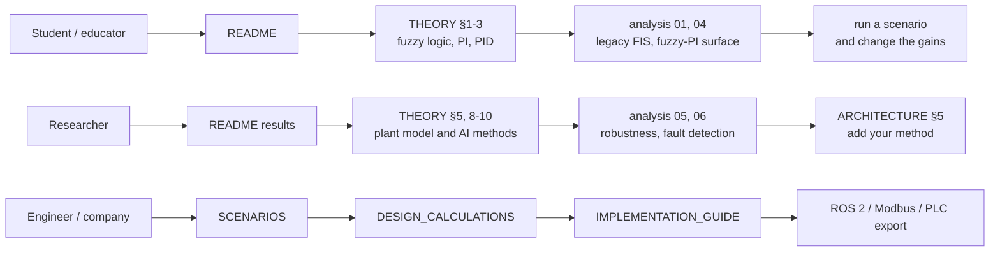

# Documentation

| Document | Contents |
|---|---|
| [../README.md](../README.md) | overview, results, quick start |
| [SCENARIOS.md](SCENARIOS.md) | the ten agricultural scenarios: problem, what they test, results; how to write your own |
| [THEORY.md](THEORY.md) | every equation used in the code (fuzzy inference, controllers, plant model, AI methods, KPIs) |
| [DESIGN_CALCULATIONS.md](DESIGN_CALCULATIONS.md) | heat-balance sizing, operating envelope, time constants, control design choices |
| [ARCHITECTURE.md](ARCHITECTURE.md) | code structure, conventions, how to extend the project |
| [IMPLEMENTATION_GUIDE.md](IMPLEMENTATION_GUIDE.md) | from simulation to a real facility: hardware, safety, commissioning, AI roll-out |
| [../analysis/README.md](../analysis/README.md) | the six engineering analyses and their results |
| [results/benchmark.md](results/benchmark.md) | full controller benchmark table and plots |

## Suggested reading paths

## Scope and limits

* All results come from a digital twin with typical parameters, not from measurements on a real
  site. Calibrate the twin with site data (`agriclimate identify --csv`) before drawing
  site-specific conclusions.
* The controllers handle temperature. Humidity is modelled and limited (heat-and-vent), but not
  controlled to a setpoint; CO₂ is not modelled.
* The MPC has no model input for scheduled internal loads (e.g. LEDs), so it performs poorly in the
  vertical-farm scenario.
* Safety still depends on independent hard-wired protection; see the implementation guide.
